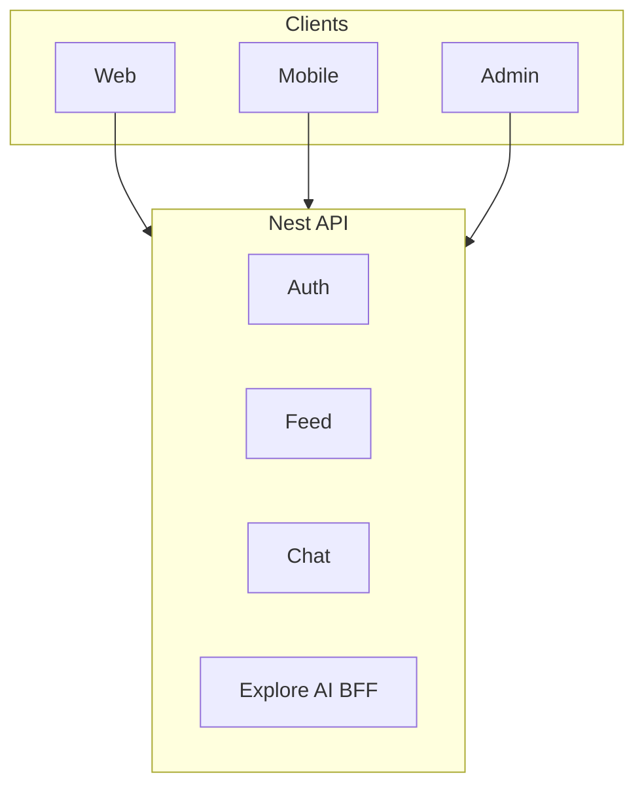

# Glossary | 领域术语表

> WhatsFeed — Ubiquitous Language（统一语言）

---

## 1. Purpose | 文档说明

This document defines the project **Ubiquitous Language**. English terms are the **preferred canonical names** and must align with code, API, and architecture naming. Chinese labels are for localization and stakeholder communication only.

### Maintenance Principles

1. **Glossary first**: Add or update terms here before implementing code
2. **Code sync**: Domain model changes must update the corresponding glossary entry
3. **Preferred term**: Use the **Preferred Term (English)** column for code, API, Jira keys, commits, and technical docs

---

## 2. Business Domains | 业务域总览

| Preferred Term | 中文            | Code / Package (Nest)            | Web (`apps/web/src`) | Mobile (Expo) (`apps/mobile/src`)  | Frontend Surface | API Prefix                   | Notes                                            |
| -------------- | --------------- | -------------------------------- | -------------------- | ---------------------------------- | ---------------- | ---------------------------- | ------------------------------------------------ |
| Auth           | 认证            | `auth/` (`auth/presentation`, …) | `auth/`              | `auth/`                            | 登录 / 注册      | `/api/v1/auth`               | JWT                                              |
| User           | 用户            | `users/`                         | `profile/`           | `profile/`                         | 个人页           | `/api/v1/users`              | 资料、搜索                                       |
| Chat           | 聊天            | `chats/`                         | `chat/`              | `chat/`                            | 消息             | `/api/v1/chats`              | 会话列表                                         |
| Message        | 消息            | `messages/`                      | `chat/`              | `chat/`                            | 私信             | `/api/v1/messages`           | 实时经 Socket.IO                                 |
| Call           | 通话            | `calls/`                         | `calls/`             | `calls/` + `core/call`             | WebRTC UI        | `/api/v1/calls`              | 信令                                             |
| Group          | 群组            | `groups/`                        | `chat/group.model`   | `chat/`                            | 群组             | `/api/v1/groups`             |                                                  |
| Post           | 帖子            | `post/`                          | `feed/`              | `feed/`                            | 发帖 / 网格      | `/api/v1/posts`              | mediaUrls、coverUrl                              |
| Feed           | 信息流          | `post/` + `graphql/`             | `feed/`              | `feed/`                            | 首页 Feed        | `/api/v1/graphql`            | Query `feed`；另有 REST `GET /api/v1/posts/feed` |
| Reels          | 短视频          | `graphql/`                       | `reels/`             | `reels/`                           | Reels Tab        | `/api/v1/graphql`            | Query `reels`                                    |
| Explore        | 探索            | `post/` + ExploreService         | `explore/`           | `explore/`                         | 探索网格         | `/api/v1/posts/explore`      | Redis 缓存                                       |
| Comment        | 评论            | `comments/`                      | `feed/components/`   | `feed/` / `app/post-comments`      | 评论弹窗         | `/api/v1/posts/:id/comments` | Mongo 可选                                       |
| Follow         | 关注            | `follow/`                        | `profile/`           | `profile/`                         | 粉丝 / 关注      | `/api/v1/users`              |                                                  |
| Search         | 搜索            | `search/`                        | `search/`            | — (embedded in `explore/`)         | 全局搜索         | `/api/v1/search`             | ES 可选                                          |
| Notification   | 通知            | `notifications/`                 | `layout/`            | `secondary/` / `app/notifications` | 通知抽屉         | `/api/v1/notifications`      | WS `notification:new`                            |
| Media          | 媒体上传        | `media/`                         | `ai/apis/file.api`   | `feed/` (upload via RTK)           | 发帖上传         | `/api/v1/media`              | 本地盘 / 对象存储                                |
| Status         | 状态            | `status/`                        | `secondary/pages/`   | `feed/` (story via feedApi)        | Status UI        | `/api/v1/status`             | 24h 状态                                         |
| Image Gen      | 图片生成        | `ai/presentation` (ImageModule)  | `ai/apis/image.api`  | —                                  | 生成对话框       | `/api/v1/image`              | Nest → media-gen                                 |
| Video Gen      | 视频生成        | `ai/presentation` (VideoModule)  | `ai/apis/video.api`  | —                                  | 生成对话框       | `/api/v1/video`              | Nest → media-gen                                 |
| Voice Gen      | 语音合成        | `ai/presentation` (VoiceModule)  | `ai/apis/voice.api`  | —                                  | 生成对话框       | `/api/v1/voice`              | Nest → media-gen                                 |
| Vision         | 视觉审核        | `ai/presentation` (VisionModule) | `ai/apis/vision.api` | —                                  | 发帖链路         | `/api/v1/vision`             | 旁路 Vision 服务                                 |
| Analytics      | 分析            | `analytics/`                     | —                    | `layout/providers`                 | Admin            | `/api/v1/analytics`          | Nest 内模块                                      |
| Ads            | 广告            | `ads/`                           | —                    | —                                  | Admin            | `/api/v1/ads`                | Nest 内模块                                      |
| Admin          | 管理            | `admin/`                         | —                    | —                                  | Admin App        | `/api/v1/admin`              | Nest 内模块                                      |
| AI Chat        | 本地 AI         | `ai/`                            | `ai/`                | —                                  | 文本生成         | `/api/v1/ai`                 | Ollama                                           |
| Explore AI BFF | Explore AI 代理 | `ai/`（ExploreAiController）     | `ai/`                | —                                  | 经 Nest 代理     | `/api/v1/ai/explore`         | 客户端勿直连 Explore AI                          |
| Health         | 健康检查        | `health/`                        | —                    | —                                  | 运维             | `/api/v1/health`             |                                                  |

---

## 3. Preferred Terms | 术语表

| Preferred Term                  | 中文             | Definition                                                                                       |
| ------------------------------- | ---------------- | ------------------------------------------------------------------------------------------------ |
| WhatsFeed                       | WhatsFeed        | 社交 + 即时通讯产品；npm scope `@whatschat/*` 为历史包名                                         |
| Cover URL                       | 封面 URL         | 视频帖封面图地址；与 mediaUrls 分离                                                              |
| Feed Entry                      | 信息流条目       | Feed 中的一条 Post 引用                                                                          |
| Engagement                      | 互动             | 点赞、收藏及计数                                                                                 |
| Explore AI BFF                  | Explore AI BFF   | Nest 服务间代理；`X-Service-Key` + `X-Client-Id`                                                 |
| Client Identity                 | 客户端身份       | 映射到 Explore AI 的稳定客户端 ID（UUID）                                                        |
| Primary Destination             | 主目的地         | 跨端规范导航身份：`feed` / `chat` / `reels` / `explore` / `user` / `search`；path/tab 由各端映射 |
| Search Scope                    | 搜索范围         | Nest `type`：`posts` / `users` / `hashtags`；UI `all` 仅客户端聚合，勿作为 API type              |
| Voice Gen Target Language       | 语音合成目标语言 | Voice Gen：`auto` / `zh` / `en`                                                                  |
| Voice Translate Target Language | 语音翻译目标语言 | Voice translate：`zh` / `en`（无 `auto`）                                                        |

---

## 4. Living docs

变更术语、模块或 API 前缀时，同步更新本文件与 [C4](developer/c4-model/)、[User Story Map](product-owner/User-Story-Map.md)。
