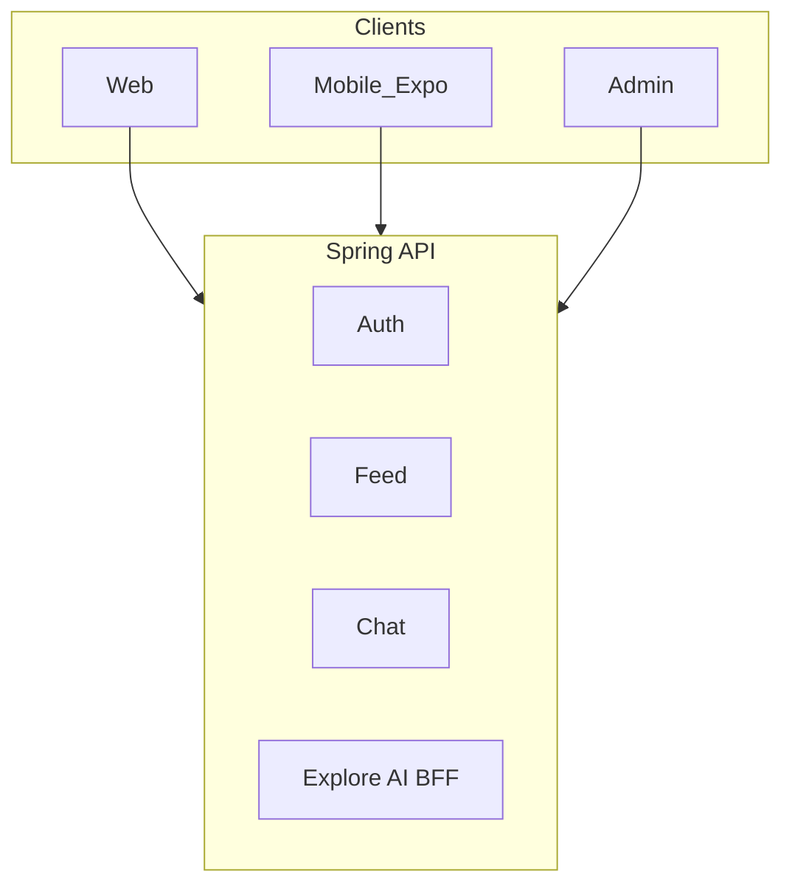

# Glossary | 领域术语表

> Chat — Ubiquitous Language（统一语言）

---

## 1. Purpose | 文档说明

This document defines the project **Ubiquitous Language**. English terms are the **preferred canonical names** and must align with code, API, and architecture naming. Chinese labels are for localization and stakeholder communication only.

### Maintenance Principles

1. **Glossary first**: Add or update terms here before implementing code
2. **Code sync**: Domain model changes must update the corresponding glossary entry
3. **Preferred term**: Use the **Preferred Term (English)** column for code, API, Jira keys, commits, and technical docs

---

## 2. Business Domains | 业务域总览

| Preferred Term | 中文            | Code / Package (Java)            | Web (`src/main/web/src`) | Mobile (Expo) (`src/main/mobile/src`)  | Frontend Surface | API Prefix                      | Notes                                            |
| -------------- | --------------- | -------------------------------- | -------------------- | ---------------------------------- | ---------------- | ------------------------------- | ------------------------------------------------ |
| Auth           | 认证            | `com.chat.auth`                  | `auth/`              | `auth/`                            | 登录 / 注册      | `/api/v1/auth`                  | JWT                 |
| User           | 用户            | `com.chat.users` / `ChatUser`                 | `profile/`           | `profile/`                         | 个人页           | `/api/v1/users`                 | 资料、搜索                                       |
| Chat           | 聊天            | `com.chat.chats`                 | `chat/`              | `chat/`                            | 消息             | `/api/v1/chats`                 | 会话列表                                         |
| Message        | 消息            | `com.chat.messages`              | `chat/`              | `chat/`                            | 私信             | `/api/v1/chats/{chat}/messages` | 子资源；实时经 Socket.IO `:9002`                 |
| Call           | 通话            | `com.chat.calls`                 | `calls/`             | `calls/` + `core/call`             | WebRTC UI        | `/api/v1/calls`                 | 信令 stub；媒体仍走 WebRTC                       |
| Group          | 群组            | `com.chat.groups`           | `chat/group.model`   | `chat/`                            | 群组             | `/api/v1/groups`                | Java stub                                   |
| Post           | 帖子            | `com.chat.post`                  | `feed/`              | `feed/`                            | 发帖 / 网格      | `/api/v1/posts`                 | mediaUrls、coverUrl                              |
| Feed           | 信息流          | `com.chat.post`   | `feed/`              | `feed/`                            | 首页 Feed        | REST `GET /posts/feed`     | Query `feed` 在切流完成前仍可走 Spring API             |
| Reels          | 短视频          | `com.chat.post`          | `reels/`             | `reels/`                           | Reels Tab        | `/api/v1/posts/reels`               | REST reels                                    |
| Explore        | 探索            | `com.chat.post`      | `explore/`           | `explore/`                         | 探索网格         | `/api/v1/posts/explore`         |                                                  |
| Comment        | 评论            | `com.chat.comments`              | `feed/components/`   | `feed/` / `app/post-comments`      | 评论弹窗         | `/api/v1/posts/{post}/comments` | 子资源                                           |
| Follow         | 关注            | `com.chat.follow`                | `profile/`           | `profile/`                         | 粉丝 / 关注      | `/api/v1/users/{user}:follow`   | AIP-136 custom method                            |
| Search         | 搜索            | `com.chat.search`                | `search/`            | — (embedded in `explore/`)         | 全局搜索         | `/api/v1/search`                |                                                  |
| Notification   | 通知            | `com.chat.notifications`         | `layout/`            | `secondary/` / `app/notifications` | 通知抽屉         | `/api/v1/notifications`         | WS `notification:new`                            |
| Media          | 媒体上传        | `com.chat.media`                 | `ai/apis/file.api`   | `feed/` (upload via RTK)           | 发帖上传         | `/api/v1/media`                 | 本地盘 / 对象存储                                |
| Status         | 状态            | `com.chat.status`           | `secondary/pages/`   | `feed/` (story via feedApi)        | Status UI        | `/api/v1/status`                | 24h 状态                                         |
| Image Gen      | 图片生成        | `com.chat.ai` → explore-ml media-gen | `ai/apis/image.api`  | —                                  | 生成对话框       | `/api/v1/image`                 | API → explore-ml `:3456`                         |
| Video Gen      | 视频生成        | `com.chat.ai` → explore-ml media-gen | `ai/apis/video.api`  | —                                  | 生成对话框       | `/api/v1/video`                 | API → explore-ml `:3456`                         |
| Voice Gen      | 语音合成        | `com.chat.ai` → explore-ml media-gen | `ai/apis/voice.api`  | —                                  | 生成对话框       | `/api/v1/voice`                 | API → explore-ml `:3456`                         |
| Vision         | 视觉审核        | `com.chat.ai` → explore-ml vision    | `ai/apis/vision.api` | —                                  | 发帖链路         | `/api/v1/vision`                | 旁路 explore-ml `:8001`                          |
| Analytics      | 分析            | `com.chat.analytics`        | —                    | `layout/providers`                 | Admin            | `/api/v1/analytics`             |                                                  |
| Ads            | 广告            | `com.chat.ads`              | —                    | —                                  | Admin            | `/api/v1/ads`                   |                                                  |
| Admin          | 管理            | `com.chat.admin`            | —                    | —                                  | Admin App        | `/api/v1/admin`                 |                                                  |
| AI Chat        | 本地 AI         | `com.chat.ai` → Ollama           | `ai/`                | —                                  | 文本生成         | `/api/v1/ai`                    | Ollama                                           |
| Explore AI BFF | Explore AI 代理 | `com.chat.ai`                    | `ai/`                | —                                  | 经 API 代理      | `/api/v1/ai/explore`            | 客户端勿直连 Explore AI                          |
| Health         | 健康检查        | `com.chat.health` + actuator     | —                    | —                                  | 运维             | `/api/v1/health`                | 另见 `/actuator/health`                          |

---

## 3. Preferred Terms | 术语表

| Preferred Term                  | 中文             | Definition                                                                                                       |
| ------------------------------- | ---------------- | ---------------------------------------------------------------------------------------------------------------- |
| Chat                     | Chat      | 社交 + 即时通讯产品；npm scope `@chat/*`；`whatschat-*` / `explorechat-*` 为历史名                                 |
| Cover URL                       | 封面 URL         | 视频帖封面图地址；与 mediaUrls 分离                                                                              |
| Feed Entry                      | 信息流条目       | Feed 中的一条 Post 引用                                                                                          |
| Engagement                      | 互动             | 点赞、收藏及计数                                                                                                 |
| Explore AI BFF                  | Explore AI BFF   | API 服务间代理；`X-Service-Key` + `X-Client-Id`                                                                  |
| Client Identity                 | 客户端身份       | 映射到 Explore AI 的稳定客户端 ID（UUID）                                                                        |
| Primary Destination             | 主目的地         | 跨端规范导航身份：`feed` / `chat` / `reels` / `explore` / `user` / `search`；path/tab 由各端映射                 |
| AIP REST                        | AIP REST         | Google API Improvement Proposals 风格的 REST：资源路径、标准方法、page_token、RpcStatus 错误；前缀仍为 `/api/v1`；Nest 与 Python ML helpers 共用 |
| RpcStatus                       | RPC 状态         | AIP-193 错误体：`{ code, message, details[] }`，对齐 google.rpc.Status JSON                                      |
| Page Token                      | 分页令牌         | AIP-158 不透明 `page_token` / `next_page_token`；客户端不解析内部 offset/cursor                                  |
| Custom Method                   | 自定义方法       | AIP-136：`POST …/{resource}:verb`（如 `:archive`、`:follow`）                                                    |
| Search Scope                    | 搜索范围         | Nest `type`：`posts` / `users` / `hashtags`；UI `all` 仅客户端聚合，勿作为 API type                              |
| Voice Gen Target Language       | 语音合成目标语言 | Voice Gen：`auto` / `zh` / `en`                                                                                  |
| Voice Translate Target Language | 语音翻译目标语言 | Voice translate：`zh` / `en`（无 `auto`）                                                                        |
| Client Message ID               | 客户端消息 ID    | 发送方生成的幂等键（`clientMsgId`）；服务端 ack 原样回传，用于乐观气泡对账                                       |
| Message Delivery Status         | 消息投递状态     | `sending`（仅客户端）→ `sent` → `delivered` → `read`；失败为 `failed`                                            |
| Abstract Immutable              | 不可变基类       | 领域内核：`id`（cuid String）、`createdAt`；对齐 Prisma；身份只落基类                                            |
| Abstract Entity                 | 实体基类         | 继承 Abstract Immutable；`updatedAt`、计划中的 `version`；可变实体继承它                                         |
| Abstract Aggregate Root         | 聚合根基类       | 继承 Abstract Entity；一致性边界（User / Chat / Message / Group / Post）                                         |
| Abstract Participant            | 参与者基类       | 继承 Abstract Entity；`userId` / `role` / `joinedAt`；Chat 与 Group 参与者共用                                   |
| Abstract Embeddable             | 嵌入值对象基类   | 无独立表身份的值对象内核                                                                                         |
| Soft Delete                     | 软删除           | Message 等领域：`isDeleted` + `delete()`；不物理删行                                                             |
| Ensure Participant              | 确保参与者       | Chat 聚合校验 userId 是否为会话参与者                                                                            |
| Assert Sendable By              | 断言可发送       | Message / Chat 侧规则：发送方须有权发往该会话                                                                    |
| Abstract Prisma Repository      | Prisma 仓储基类  | infra 通用基类，持有 PrismaClient；各 `*Repository` 实现继承它以减样板；domain 不依赖 Prisma                     |

---

## 4. Living docs

变更术语、模块或 API 前缀时，同步更新本文件与 [C4](developer/c4-model/)、[User Story Map](product-owner/User-Story-Map.md)。
