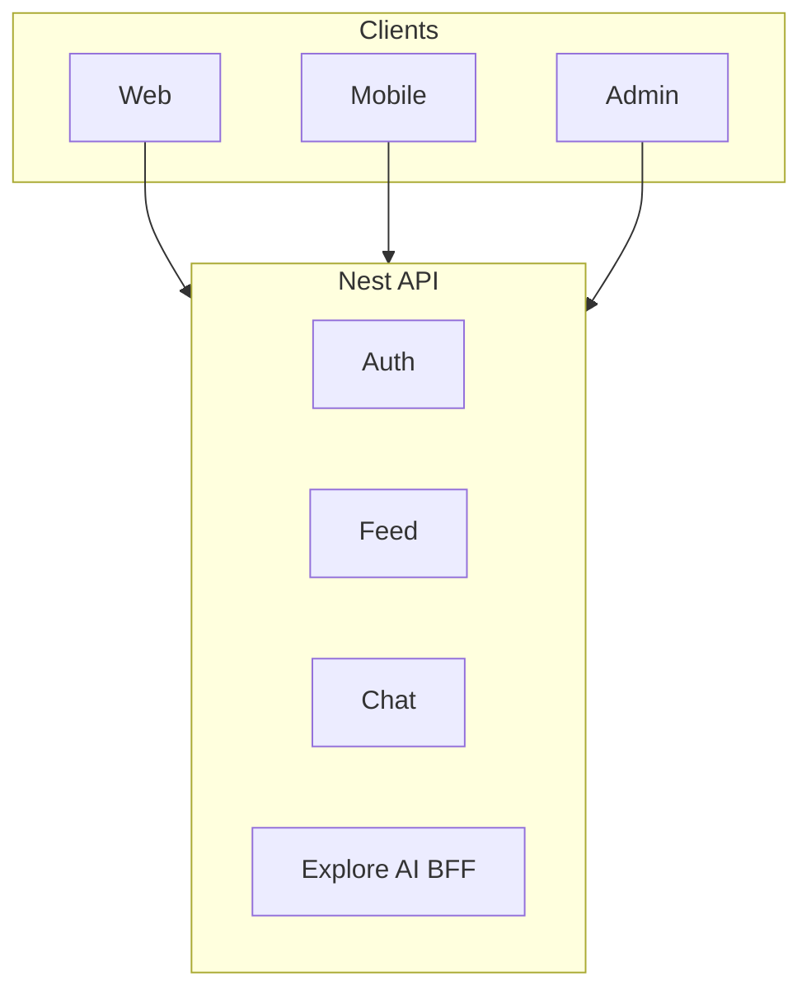

# Glossary | 领域术语表

> WhatsFeed — Ubiquitous Language（统一语言）

---

## 1. Purpose | 文档说明

This document defines the project **Ubiquitous Language**. English terms are the **preferred canonical names** and must align with code, API, and architecture naming. Chinese labels are for localization and stakeholder communication only.

### Maintenance Principles

1. **Glossary first**: Add or update terms here before implementing code
2. **Code sync**: Domain model changes must update the corresponding glossary entry
3. **Preferred term**: Use the **Preferred Term (English)** column for code, API, Jira keys, commits, and technical docs

---

## 2. Business Domains | 业务域总览

| Preferred Term | 中文            | Code / Package               | Frontend Surface | API Prefix                   | Notes                   |
| -------------- | --------------- | ---------------------------- | ---------------- | ---------------------------- | ----------------------- |
| Auth           | 认证            | `presentation/auth`          | 登录 / 注册      | `/api/v1/auth`               | JWT                     |
| User           | 用户            | `presentation/users`         | 个人页           | `/api/v1/users`              | 资料、搜索              |
| Chat           | 聊天            | `presentation/chats`         | 消息             | `/api/v1/chats`              | 会话列表                |
| Message        | 消息            | `presentation/messages`      | 私信             | `/api/v1/messages`           | 实时经 Socket.IO        |
| Call           | 通话            | `presentation/calls`         | WebRTC UI        | `/api/v1/calls`              | 信令                    |
| Group          | 群组            | `presentation/groups`        | 群组             | `/api/v1/groups`             |                         |
| Post           | 帖子            | `presentation/post`          | 发帖 / 网格      | `/api/v1/posts`              | mediaUrls、coverUrl     |
| Feed           | 信息流          | GraphQL + feed services      | 首页 Feed        | `/api/v1/graphql`            | Query `feed`            |
| Reels          | 短视频          | GraphQL                      | Reels Tab        | `/api/v1/graphql`            | Query `reels`           |
| Explore        | 探索            | explore services             | 探索网格         | REST explore                 | Redis 缓存              |
| Comment        | 评论            | `presentation/comments`      | 评论弹窗         | `/api/v1/posts/:id/comments` | Mongo 可选              |
| Follow         | 关注            | `presentation/follow`        | 粉丝 / 关注      | `/api/v1/users`              |                         |
| Search         | 搜索            | `presentation/search`        | 全局搜索         | `/api/v1/search`             | ES 可选                 |
| Notification   | 通知            | `presentation/notifications` | 通知抽屉         | `/api/v1/notifications`      | WS `notification:new`   |
| Media          | 媒体上传        | `presentation/media`         | 发帖上传         | `/api/v1/media`              | 本地盘 / 对象存储       |
| Vision         | 视觉审核        | `presentation/vision`        | 发帖链路         | `/api/v1/vision`             | 旁路 Vision 服务        |
| Analytics      | 分析            | `presentation/analytics`     | Admin            | `/api/v1/analytics`          |                         |
| Ads            | 广告            | `presentation/ads`           | Admin            | `/api/v1/ads`                |                         |
| Admin          | 管理            | `presentation/admin`         | Admin App        | `/api/v1/admin`              |                         |
| AI Chat        | 本地 AI         | `presentation/ai`            | 文本生成         | `/api/v1/ai`                 | Ollama                  |
| Explore AI BFF | Explore AI 代理 | `presentation/ai/explore`    | 经 Nest 代理     | `/api/v1/ai/explore`         | 客户端勿直连 Explore AI |
| Health         | 健康检查        | `presentation/health`        | 运维             | `/api/v1/health`             |                         |

---

## 3. Preferred Terms | 术语表

| Preferred Term  | 中文           | Definition                                       |
| --------------- | -------------- | ------------------------------------------------ |
| WhatsFeed       | WhatsFeed      | 社交 + 即时通讯产品（代码中亦称 WhatsChat）      |
| Cover URL       | 封面 URL       | 视频帖封面图地址；与 mediaUrls 分离              |
| Feed Entry      | 信息流条目     | Feed 中的一条 Post 引用                          |
| Engagement      | 互动           | 点赞、收藏及计数                                 |
| Explore AI BFF  | Explore AI BFF | Nest 服务间代理；`X-Service-Key` + `X-Client-Id` |
| Client Identity | 客户端身份     | 映射到 Explore AI 的稳定客户端 ID（UUID）        |

---

## 4. Living docs

变更术语、模块或 API 前缀时，同步更新本文件与 [C4](developer/c4-model/)、[User Story Map](product-owner/User-Story-Map.md)。
