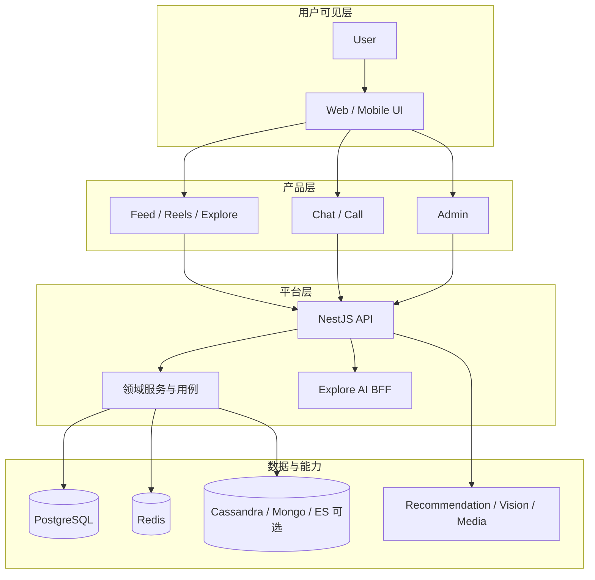

# 沃德利地图 (Wardley Map)

> 基于 Simon Wardley 战略地图方法论，描述 WhatsFeed 各组件在价值链上的位置与演化阶段。

## 价值链概览

```
用户 → Web/Mobile/Admin → REST/GraphQL/WS API → 领域服务 → 数据与旁路 AI/推荐 → 基础设施
```



## 演化阶段（示意）

| 组件                           | 大致阶段         | 说明                       |
| ------------------------------ | ---------------- | -------------------------- |
| Instagram 风格 Feed / Reels UI | Product          | 产品化交互模式             |
| NestJS API + Prisma            | Product          | 成熟框架                   |
| Socket.IO 实时消息             | Product          | 商品化实时通道             |
| PostgreSQL / Redis             | Commodity        | 托管即可用                 |
| Cassandra Feed 宽表            | Custom           | 可选、运维成本高           |
| Explore AI BFF                 | Custom → Product | 服务间集成，边界清晰       |
| 本地 Ollama                    | Genesis / Custom | 开发期默认                 |
| 容器化生产部署                 | Custom           | 目标 MVP，尚未作为既定商品 |

## 战略关注点

1. **必需路径**：Nest + PostgreSQL + Redis 足以启动核心 API。
2. **差异化**：Feed / Explore / 实时聊天与 Instagram 一致体验。
3. **外部杠杆**：Explore AI 经 BFF 复用，避免浏览器直连。
4. **演化方向**：媒体从本地盘迁向对象存储；生产托管 API + 托管数据。

详细组件分解的历史 PlantUML 素材已收敛为本 Markdown；软件边界见 [C4](developer/c4-model/)，企业架构见 [TOGAF](product-owner/togaf/)。
