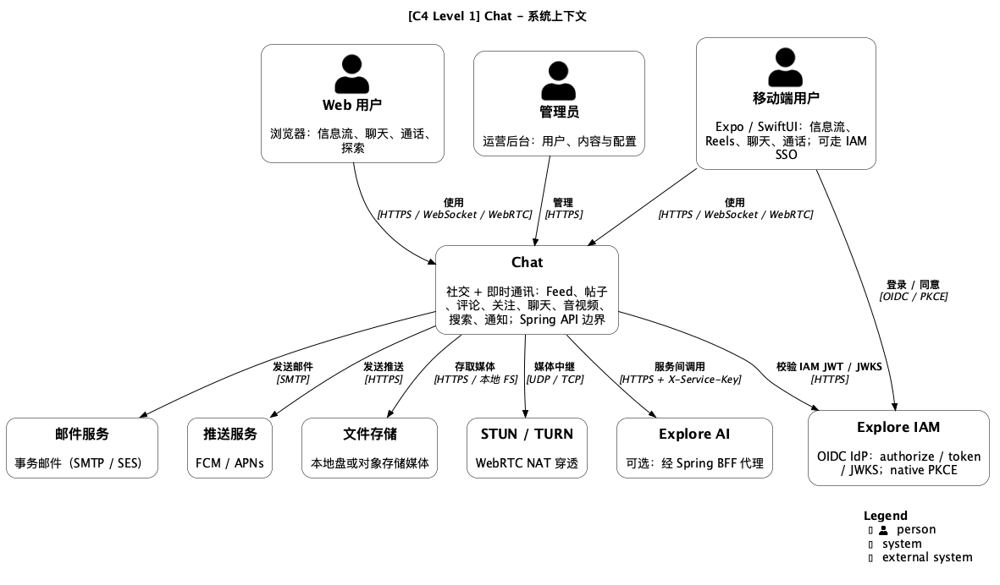
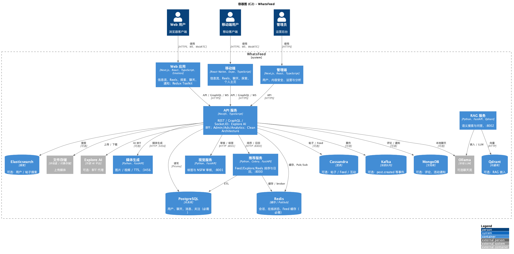
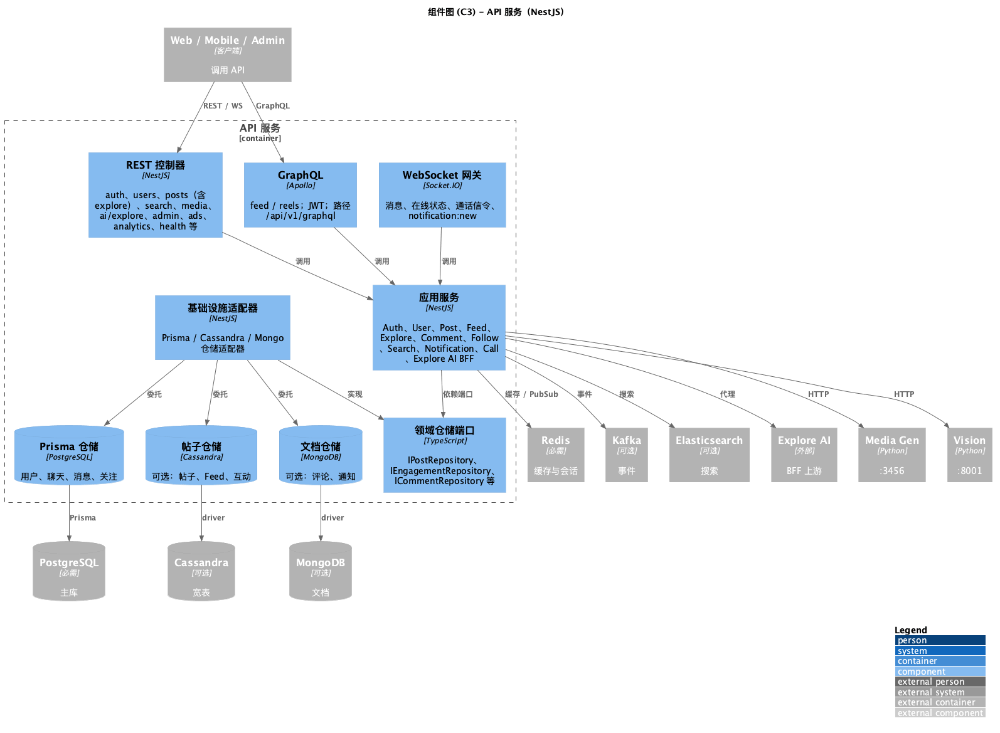
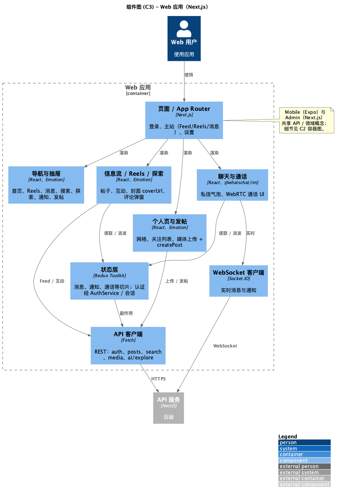
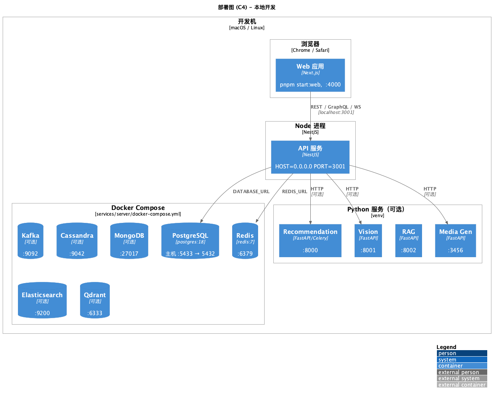
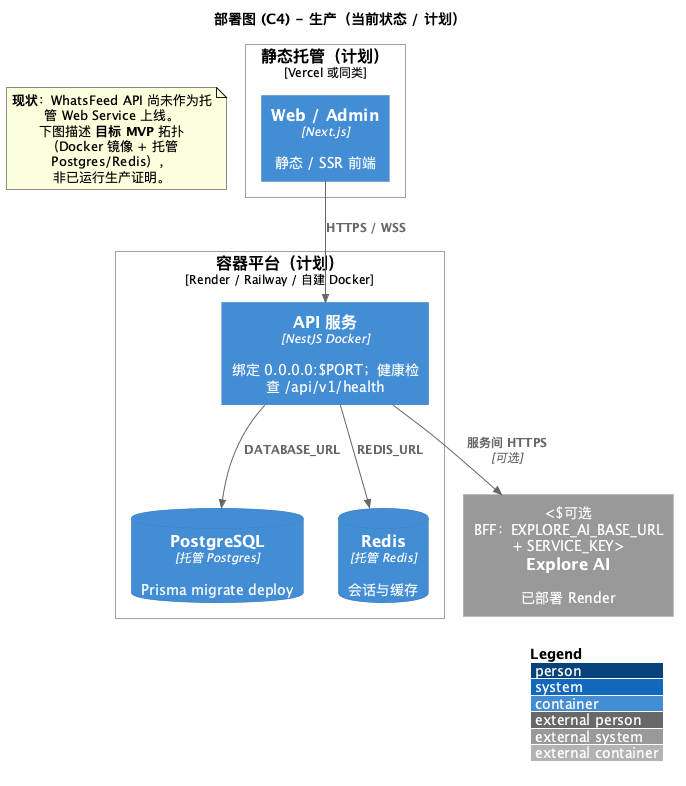

# C4 模型文档

使用 PlantUML（C4-PlantUML）描述 WhatsFeed 软件架构。`.puml` 为源文件；`png/` 为导出预览。

产品交付状态见 [User Story Map](../../product-owner/User-Story-Map.md)。本目录聚焦 **C4 软件架构**。

> **注意**：以 `.puml` 为准；改图后应重渲 `png/`。

## 文件

| 文件                            | 层级 | 说明                                                      |
| ------------------------------- | ---- | --------------------------------------------------------- |
| `C1-Context.puml`               | C1   | 系统上下文（用户、WhatsFeed、外部系统）                   |
| `C2-Container.puml`             | C2   | 容器（Web/Admin/Mobile、Nest API、Python 服务、数据存储） |
| `C3-Component-Backend.puml`     | C3   | NestJS API 组件与 Clean Architecture 端口/适配器          |
| `C3-Component-Frontend.puml`    | C3   | Web（Next.js）主要 UI / 状态 / 客户端；Mobile/Admin 见 C2 |
| `C4-Deployment.puml`            | C4   | 本地开发（compose + Nest `:3001`）                        |
| `C4-Deployment-Production.puml` | C4   | 生产目标 MVP（尚未宣称已上线）                            |

## 预览

### C1 - 系统上下文

### C2 - 容器

### C3 - 后端

### C3 - 前端

### C4 - 本地部署

### C4 - 生产（计划）

## 技术栈摘要

| 层          | 技术                                                                   |
| ----------- | ---------------------------------------------------------------------- |
| Web / Admin | Next.js、React、TypeScript、Emotion、Redux Toolkit                     |
| Mobile      | React Native、Expo                                                     |
| API         | NestJS 10、Prisma、Socket.IO、GraphQL（Apollo）                        |
| 必需数据    | PostgreSQL、Redis                                                      |
| 可选数据    | Cassandra、MongoDB、Elasticsearch、Kafka、Qdrant                       |
| 旁路服务    | recommendation `:8000`、vision `:8001`、rag `:8002`、media-gen `:3456` |
| AI          | 本地 Ollama；Explore AI 经 Nest BFF（`/api/v1/ai/explore/*`）          |

## 查看方式

- VS Code PlantUML 扩展预览
- CLI：`plantuml docs/developer/c4-model/*.puml`
- Include 使用 C4-PlantUML 远程 stdlib（无需 `docs/c4-lib`）
