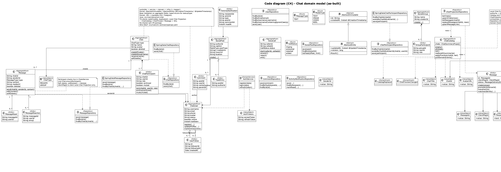
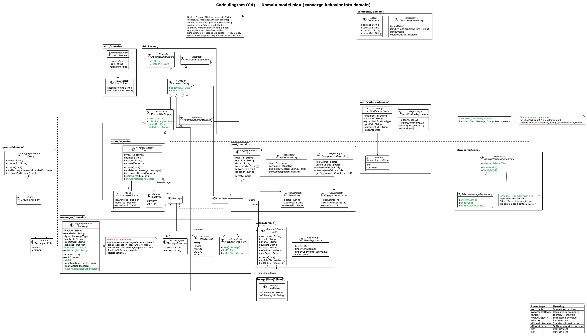
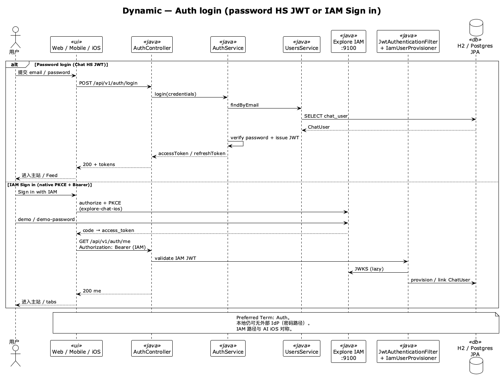
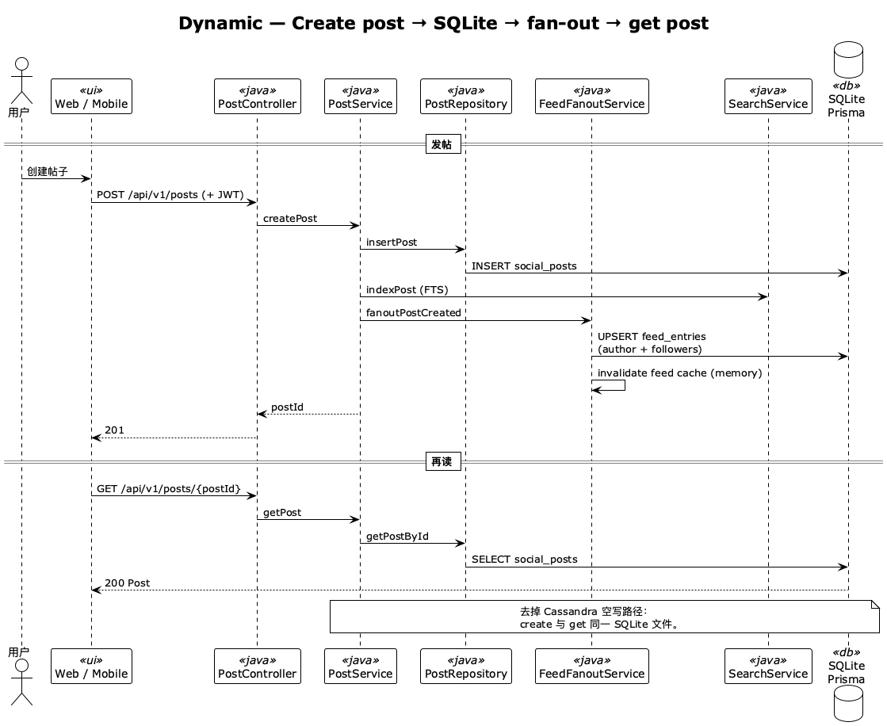
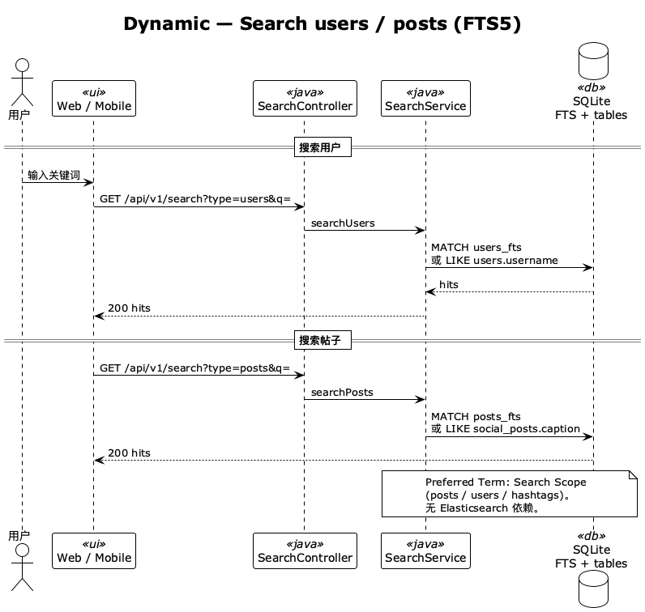

# C4 模型

Chat 的架构视图。源文件为 `.puml`；PNG 可选。术语见 [Glossary](../../Glossary.md)；产品状态见 [User Story Map](../../product-owner/User-Story-Map.md)。

命名对齐 C4：`C1-Context` / `C2-Container` / `C3-Component` / `C4-Code-*` / `C4-Deployment` / `C4-Dynamic-*`。

视觉对齐 partner/iam：**白底黑字黑边框**；结构图内联 `style.puml` 同等语句（勿 `!include`，预览临时目录会失败）。**不要**启用 `!NEW_C4_STYLE`。

---

## 文件

| 文件                               | 层级       | 说明                                                |
| ---------------------------------- | ---------- | --------------------------------------------------- |
| `C1-Context.puml`                  | C1         | 系统上下文                                          |
| `C2-Container.puml`                | C2         | 容器（Web / Admin / Mobile / Spring :9001 / 旁路） |
| `C3-Component.puml`                | C3         | 组件（Web + Expo + iOS + Spring）               |
| `C4-Code-Domain-Model.puml`        | Code       | 领域模型（对齐当前代码）                            |
| `C4-Code-Domain-Model-Plan.puml`   | Code       | 规划差分（少 AR、简化命名；绿增/红删）              |
| `C4-Deployment.puml`               | Deployment | 本地开发部署（含生产简述）                          |
| `C4-Dynamic-Auth-Login.puml`       | Dynamic    | 登录 → JWT                                          |
| `C4-Dynamic-Post-Create-Feed.puml` | Dynamic    | 发帖 → JPA → fan-out → 读帖                         |
| `C4-Dynamic-Search-FTS.puml`       | Dynamic    | 搜索（JPA LIKE；文件名历史遗留）                    |
| `style.puml`                       | Shared     | 结构图规范副本（内联用）                            |

---

## Context


---

## Container


---

## Component


---

## Code



对齐 Java feature 包：`controller` / `service` / `domain` / `infra` / `mapper`，以及
`base/domain`（`AbstractImmutable` → `AbstractEntity` + `@Version`）。持久化：JPA + Liquibase（H2 / Postgres）。

服务端：`Chat.createPrivate|createGroup`、`Message.send|edit|softDelete`；参与者校验在
`ChatsService`；infra 为 `SpringData*Repository`。客户端 Local Chat Projection（Web / Expo，源码同构）：
`ChatCatalog` / `ChatThread` / `Message` + VOs；wire SSoT：`src/main/im-contract/openapi.yaml`（无共享 npm）。

### Plan



相对 as-built 的**规划差分**（绿增 / 红删）：少聚合根、简化命名与关系。

- 服务端 AR：`User` / `Chat` / `Post`；`Message` 降为 Chat 内 Entity；`Group` 降为 Entity（会话用 `Chat`）
- 命名对齐 Glossary：`ChatUser→User`、`SocialPost→Post`、`ActivityNotification→Notification`
- 客户端：仅 `ChatThread` 为 AR；`ChatCatalog` 为 ReadModel；消息实体 `ThreadMessage`
- 行为收敛：`Chat.ensureParticipant`；可选服务端 `clientMsgId`

```bash
cd docs/developer/c4-model && plantuml -tpng -o png C4-Code-Domain-Model-Plan.puml
```

---

## Deployment


本地：`pnpm` 启 Web `:4000` + Spring API `:9001` / Socket `:9002` + H2（或 `DATABASE_URL` Postgres）。生产拓扑以图内 note 简述；**不**默认 docker compose。

---

## Dynamic

仅保留关键运行时路径。

### Auth Login



用户提交凭据 → `POST /api/v1/auth/login` → JPA 读 `chat_user` → 签发 JWT。

### Post Create → Feed



发帖写入 `social_posts` → 进程内 fan-out `feed_entries` → 再 `GET` 同帖。

### Search



`/api/v1/search`：`UserRepository` / `SocialPostRepository` / `HashtagRepository`（JPA LIKE / 过滤）；无 FTS5 / Elasticsearch。

---

## 技术栈

| 层           | 要点                                                                                   |
| ------------ | -------------------------------------------------------------------------------------- |
| Web / Admin  | Next.js、React、TypeScript；`:4000` / `:4001`                                          |
| Mobile       | Expo / React Native (`src/main/mobile`)                                                        |
| API          | Spring Boot；REST / Socket.IO；`:9001`                                         |
| 持久化       | H2 / Postgres（JPA + Liquibase）                                                       |
| 旁路（可选） | [explore-ml](https://github.com/felixzhu97/explore-ml) `python_ml/` — recommendation `:8000`、vision `:8001`、rag `:8002`、media-gen `:3456` |
| AI           | 本地 Ollama；Explore AI 经 Spring BFF                                                  |

限界上下文（Java）：`auth` / `users` / `post` / `comments` / `chats` / `search` / `notifications` / …

---

## 渲染

```bash
cd docs/developer/c4-model && mkdir -p png && plantuml -tpng -o png *.puml
```

或：

```bash
cd docs/developer/c4-model && docker run --rm -v "$PWD":/data plantuml/plantuml -tpng -o png '*.puml'
```

依赖 [C4-PlantUML](https://github.com/plantuml-stdlib/C4-PlantUML) 远程 include。

---

## 相关内容

- [Glossary](../../Glossary.md)
- [Guideline](../../Guideline.md)
- [QUICKSTART](../QUICKSTART.md)
- [User Story Map](../../product-owner/User-Story-Map.md)
