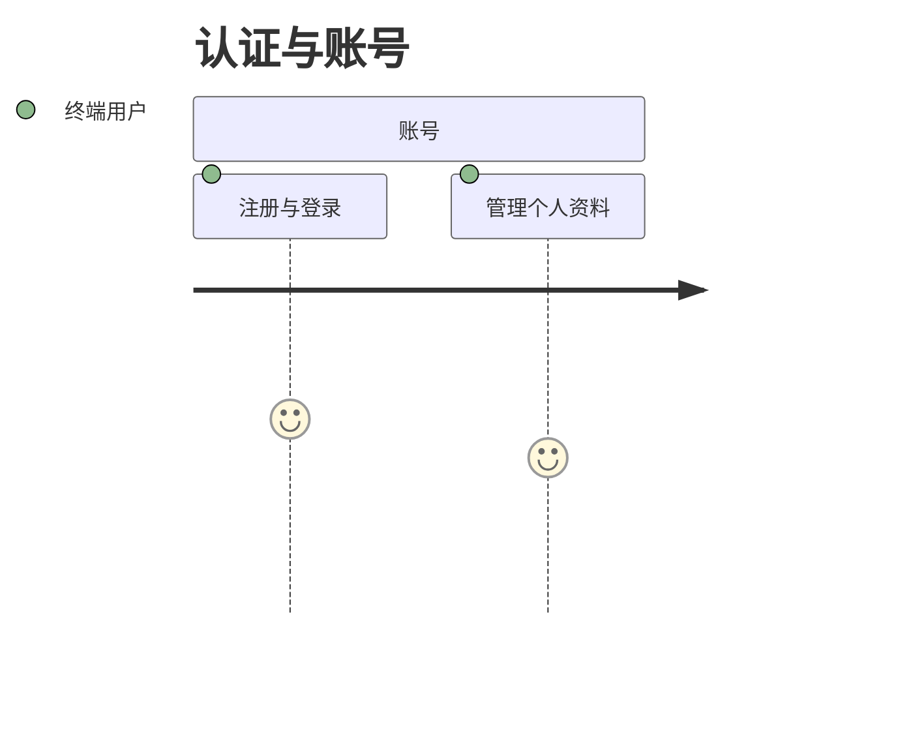
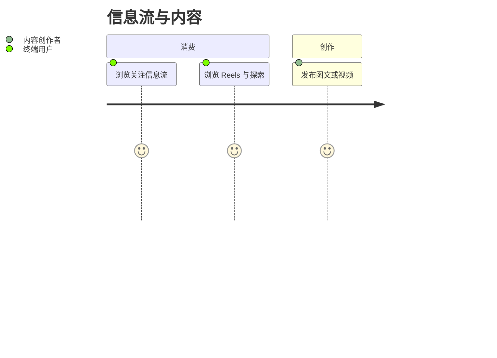
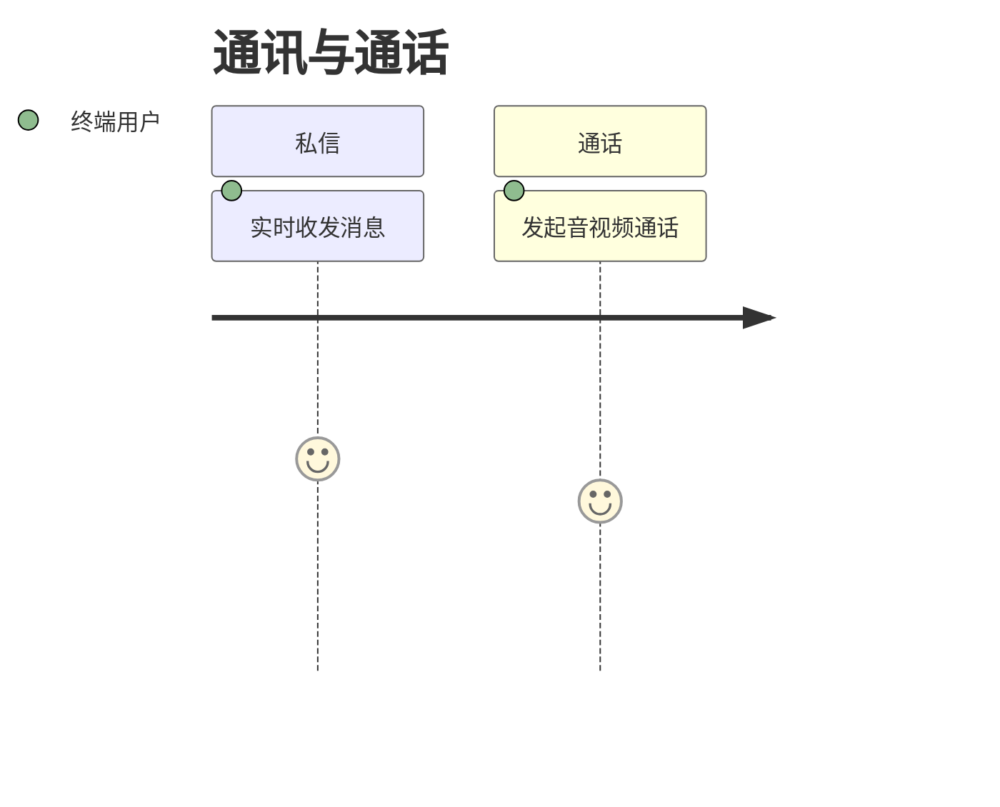
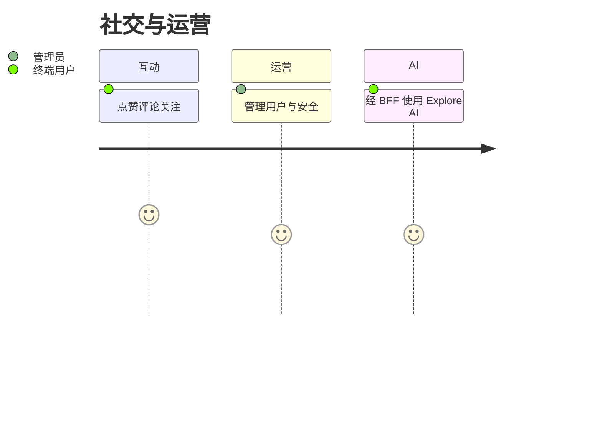

# 用户故事地图

> 格式：Jeff Patton 故事地图 + Mermaid journey + GWT（Epic 分文件）。  
> 故事正文与验收标准见 [user-stories/](./user-stories/)；本页只做索引，避免双源。

## 用户画像

| 角色                | 说明                                          |
| ------------------- | --------------------------------------------- |
| 终端用户            | 使用信息流、Reels、探索、私信与通话           |
| 内容创作者          | 发帖、上传媒体、管理个人主页                  |
| 管理员              | 通过管理后台运营用户与内容安全                |
| 开发者 / 平台工程师 | 部署、对象存储、推荐与审核链路（进行中/规划） |

## 旅程总览

### 认证与账号

### 信息流与内容

### 通讯与通话

### 社交与运营

---

## Backbone 故事地图

### 已交付

| 认证                                                                 | 私信                                                            | 信息流                                                               | Reels/探索                                                         | 互动                                                                      | 通话                                                      | 管理                                                        | AI BFF                                                                                   |
| -------------------------------------------------------------------- | --------------------------------------------------------------- | -------------------------------------------------------------------- | ------------------------------------------------------------------ | ------------------------------------------------------------------------- | --------------------------------------------------------- | ----------------------------------------------------------- | ---------------------------------------------------------------------------------------- |
| [US-01](./user-stories/E1-auth-account.md#us-01-注册与登录) 注册登录 | [US-02](./user-stories/E2-messaging.md#us-02-实时私信) 实时私信 | [US-03](./user-stories/E3-feed-posts.md#us-03-浏览信息流) 浏览信息流 | [US-05](./user-stories/E4-reels-explore.md#us-05-浏览-reels) Reels | [US-07](./user-stories/E5-engagement-social.md#us-07-点赞收藏与评论) 互动 | [US-09](./user-stories/E6-calls.md#us-09-音视频通话) 通话 | [US-10](./user-stories/E7-admin.md#us-10-管理后台) 管理后台 | [US-11](./user-stories/E8-explore-ai-bff.md#us-11-经-bff-使用-explore-ai) Explore AI BFF |
|                                                                      |                                                                 | [US-04](./user-stories/E3-feed-posts.md#us-04-发布帖子) 发帖         | [US-06](./user-stories/E4-reels-explore.md#us-06-探索网格) 探索    | [US-08](./user-stories/E5-engagement-social.md#us-08-关注关系) 关注       |                                                           |                                                             |                                                                                          |

### 进行中

| 平台                                                                          |
| ----------------------------------------------------------------------------- |
| [US-12](./user-stories/E9-platform-future.md#us-12-生产部署) 生产部署         |
| [US-13](./user-stories/E9-platform-future.md#us-13-对象存储媒体) 对象存储媒体 |

### 未来（规划中）

| 平台                                                                              |
| --------------------------------------------------------------------------------- |
| [US-14](./user-stories/E9-platform-future.md#us-14-完整推荐与审核) 推荐与审核     |
| [US-15](./user-stories/E9-platform-future.md#us-15-离线与多设备同步) 离线与多设备 |

---

## Epic 索引

| Epic              | 文件                                                              | 故事          | 状态            |
| ----------------- | ----------------------------------------------------------------- | ------------- | --------------- |
| E1 认证与账号     | [E1-auth-account.md](./user-stories/E1-auth-account.md)           | US-01         | 已实现          |
| E2 即时通讯       | [E2-messaging.md](./user-stories/E2-messaging.md)                 | US-02         | 已实现          |
| E3 信息流与帖子   | [E3-feed-posts.md](./user-stories/E3-feed-posts.md)               | US-03 – US-04 | 已实现          |
| E4 Reels 与探索   | [E4-reels-explore.md](./user-stories/E4-reels-explore.md)         | US-05 – US-06 | 已实现          |
| E5 互动与社交     | [E5-engagement-social.md](./user-stories/E5-engagement-social.md) | US-07 – US-08 | 已实现          |
| E6 音视频通话     | [E6-calls.md](./user-stories/E6-calls.md)                         | US-09         | 已实现          |
| E7 管理后台       | [E7-admin.md](./user-stories/E7-admin.md)                         | US-10         | 已实现          |
| E8 Explore AI BFF | [E8-explore-ai-bff.md](./user-stories/E8-explore-ai-bff.md)       | US-11         | 已实现          |
| E9 平台与未来     | [E9-platform-future.md](./user-stories/E9-platform-future.md)     | US-12 – US-15 | 进行中 / 规划中 |

## 参考

- [User Story Mapping — Jeff Patton](https://www.jpattonassociates.com/user-story-mapping/)
- [Domain Glossary](../Glossary.md)
- [C4 模型](../developer/c4-model/README.md)
