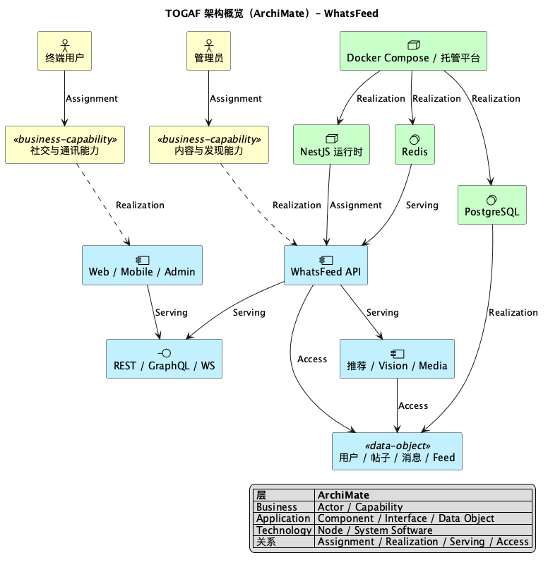
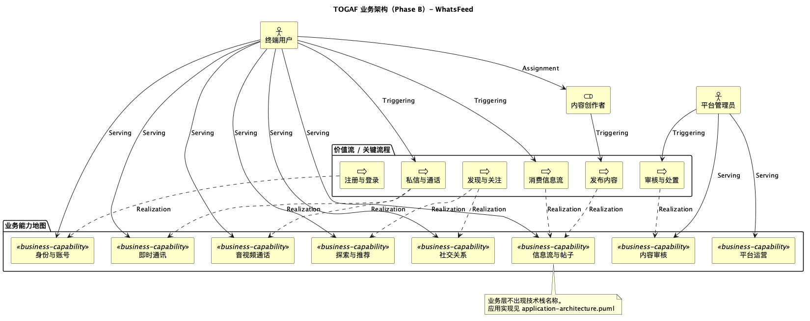
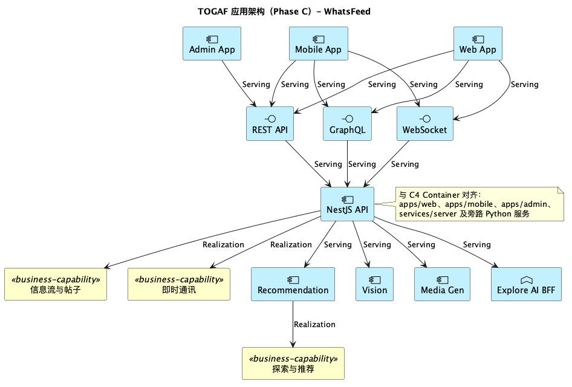
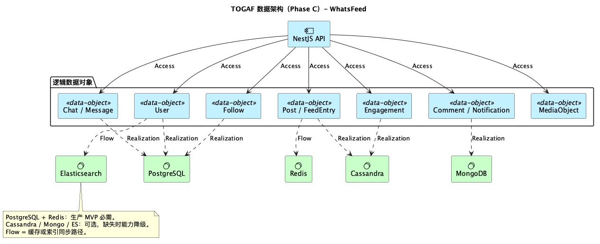
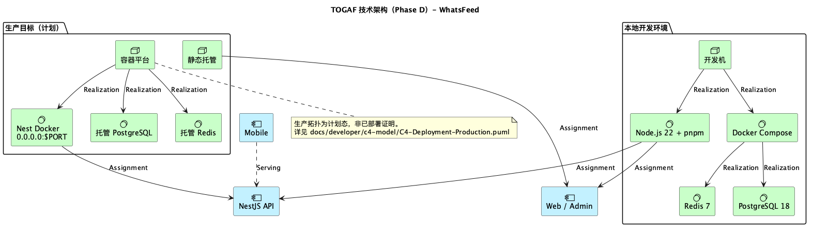

# TOGAF – WhatsFeed

企业架构四域视图，使用 **ArchiMate 3.x** 记法（PlantUML `archimate`），对应 TOGAF ADM Phase B / C / D。

软件组件与部署细节以 [C4 模型](../../developer/c4-model/) 为准；本目录不重复 C4 容器内部结构。

## 图表

| 域   | 文件                                                             | 视点                                                                |
| ---- | ---------------------------------------------------------------- | ------------------------------------------------------------------- |
| 概览 | [overview.puml](./overview.puml)                                 | Architecture Vision：Business → Application → Technology，Data 横切 |
| 业务 | [business-architecture.puml](./business-architecture.puml)       | Phase B：Actor / Role / Capability / Process                        |
| 应用 | [application-architecture.puml](./application-architecture.puml) | Phase C：Application Component / Interface                          |
| 数据 | [data-architecture.puml](./data-architecture.puml)               | Phase C：Data Object 与持久化 Realization                           |
| 技术 | [technology-architecture.puml](./technology-architecture.puml)   | Phase D：Node / System Software 与环境                              |

## 图例（ArchiMate）

| 元素                                               | 用途                 |
| -------------------------------------------------- | -------------------- |
| Business Actor / Role                              | 参与者与职责         |
| Business Capability / Process                      | 能力地图与价值流活动 |
| Application Component / Interface / Function       | 应用与接口           |
| Data Object                                        | 逻辑数据             |
| Technology Node / System Software                  | 运行时与平台         |
| Assignment / Realization / Serving / Access / Flow | 标准关系             |

## 与 C4 的分工

| 文档            | 回答的问题                                     |
| --------------- | ---------------------------------------------- |
| TOGAF（本目录） | 业务能力如何被应用与技术实现？数据与平台原则？ |
| C4              | 代码边界、容器通信、部署拓扑细节？             |

## 规范

[.cursor/rules/togaf-specification.mdc](../../../.cursor/rules/togaf-specification.mdc)

## 预览

| 图          | PNG                                       |
| ----------- | ----------------------------------------- |
| Overview    |        |
| Business    |        |
| Application |  |
| Data        |                |
| Technology  |    |

## 查看

```bash
plantuml docs/product-owner/togaf/*.puml -o png
```
