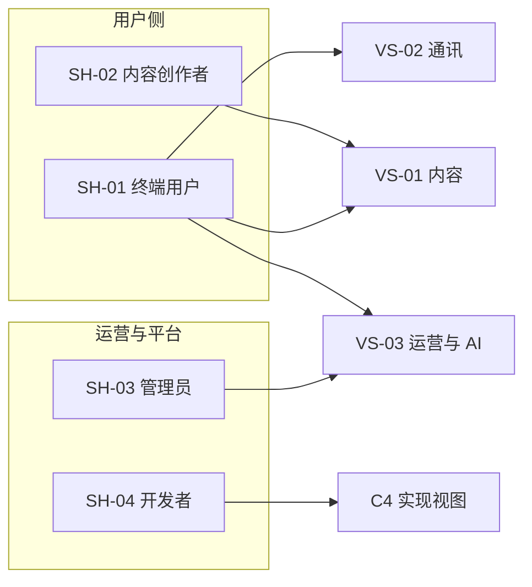

# Diagram — Stakeholder Map

> 负责人：Product Owner · ADM Phase A  
> Catalog：[stakeholders.md](./stakeholders.md)

```mermaid
flowchart LR
  subgraph users [用户侧]
    SH01[SH-01 终端用户]
    SH02[SH-02 内容创作者]
  end
  subgraph ops [运营与平台]
    SH03[SH-03 管理员]
    SH04[SH-04 开发者]
  end
  SH01 --> VS01[VS-01 内容]
  SH01 --> VS02[VS-02 通讯]
  SH02 --> VS01
  SH03 --> VS03[VS-03 运营与 AI]
  SH01 --> VS03
  SH04 --> C4[C4 实现视图]
```
