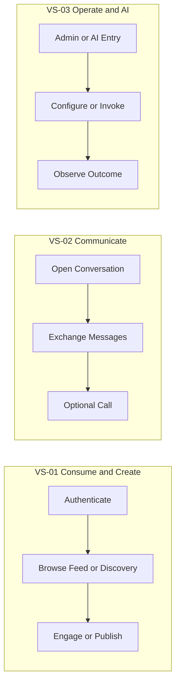

# Diagram — Value Streams

> 负责人：Product Owner · ADM Phase B  
> Catalog：[value-streams.md](./value-streams.md)

```mermaid
flowchart LR
  subgraph vs1 [VS-01 Consume and Create]
    A1[Authenticate] --> A2[Browse Feed or Discovery]
    A2 --> A3[Engage or Publish]
  end
  subgraph vs2 [VS-02 Communicate]
    B1[Open Conversation] --> B2[Exchange Messages]
    B2 --> B3[Optional Call]
  end
  subgraph vs3 [VS-03 Operate and AI]
    C1[Admin or AI Entry] --> C2[Configure or Invoke]
    C2 --> C3[Observe Outcome]
  end
```
